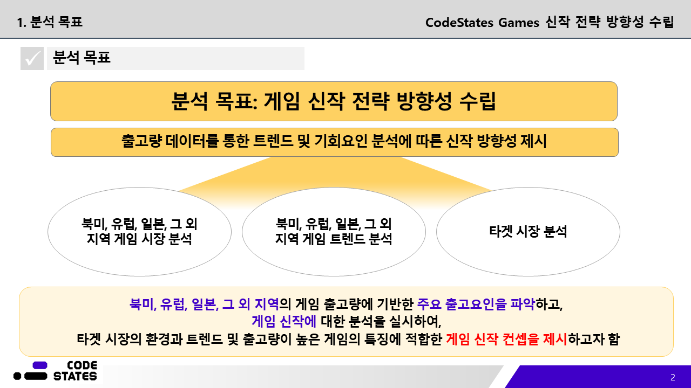
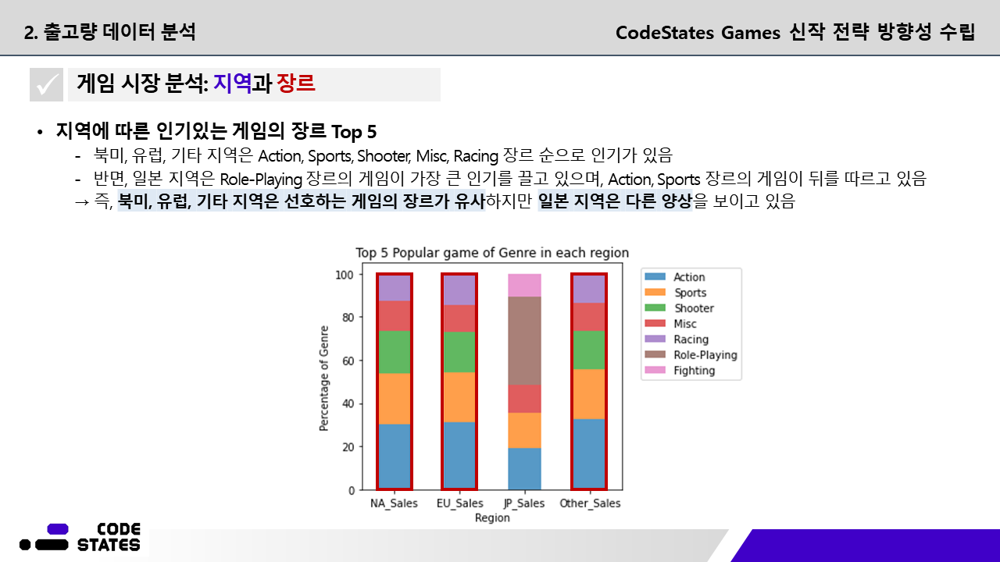
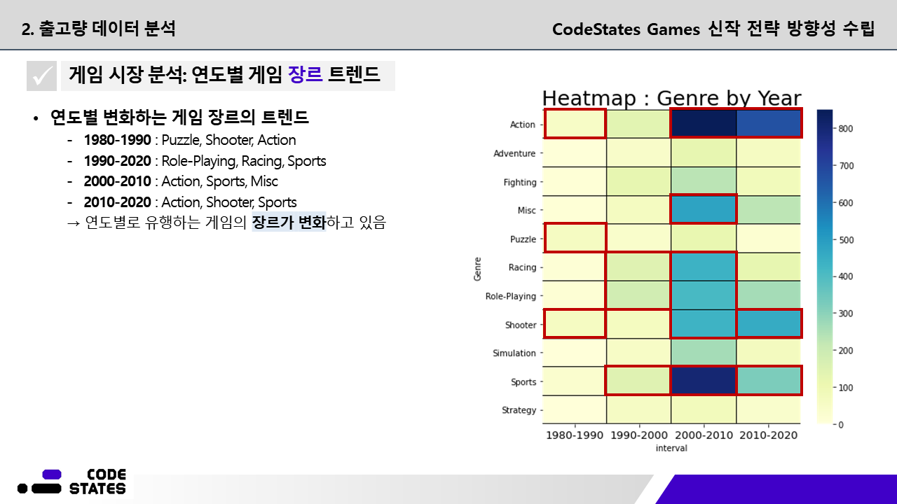
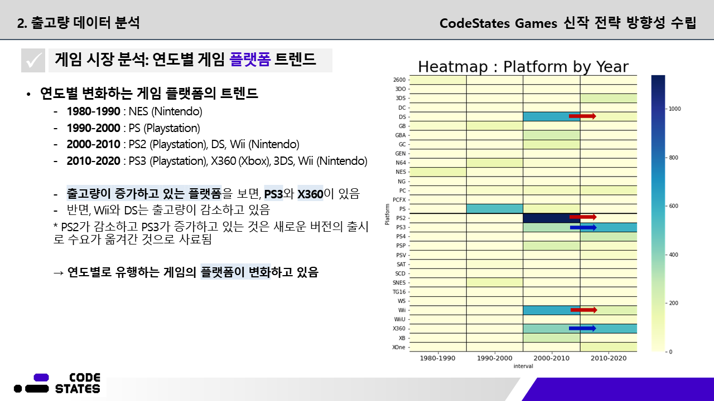
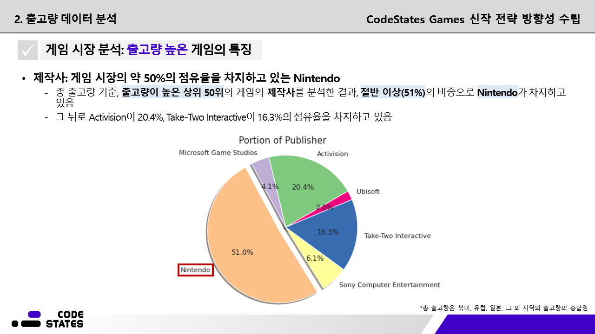
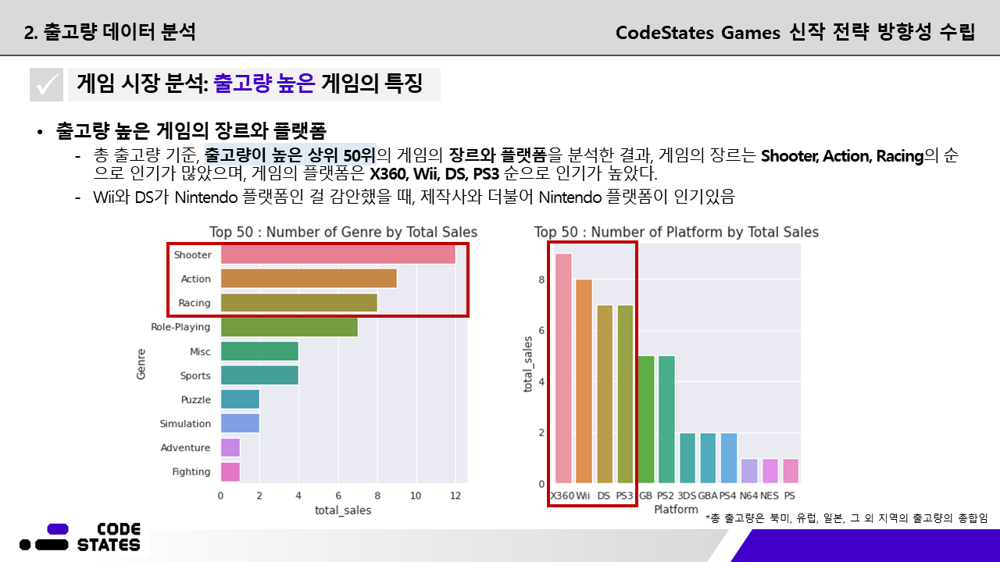
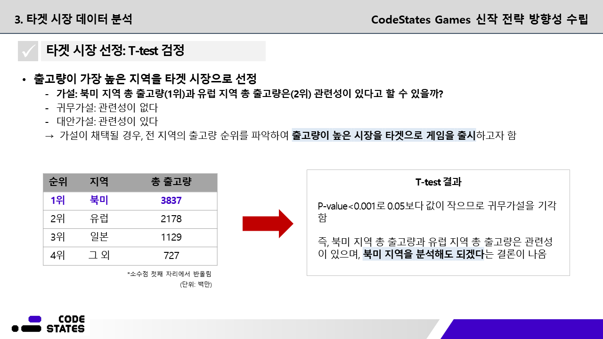
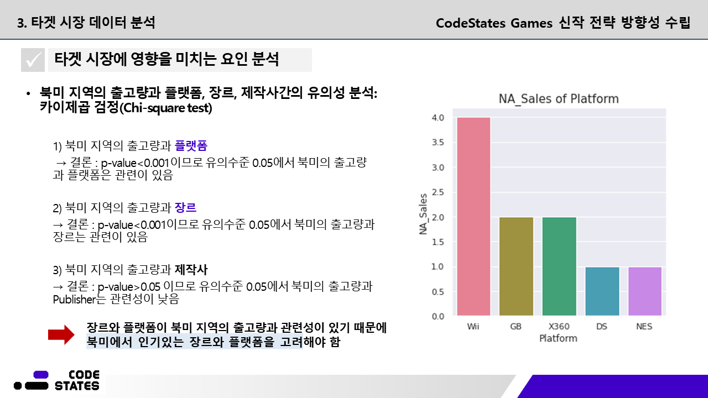
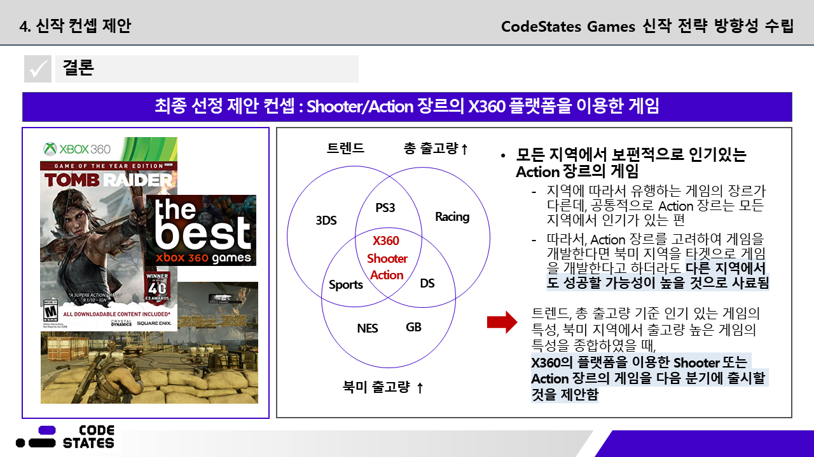

# Development of Game Release Strategy
- 프로젝트 기간: 2021.07.29 - 2021.08.03
---
## 프로젝트 목표

---
## 데이터셋 설명
- 총 8개의 열로 구성
>- Name: 게임의 이름
>- Platform: 게임이 지원되는 플랫폼의 이름
>- Year: 게임이 출시된 연도
>- Genre: 게임의 장르
>- Publisher: 게임을 제작한 회사
>- NA_Sales: 북미지역에서의 출고량
>- EU_Sales: 유럽지역에서의 출고량
>- Other_Sales: 기타지역에서의 출고량 
---
## 분석 과정
- 시각화를 통한 탐색적 데이터 분석(EDA)을 함
- T-test 검정을 통해 타겟 시장을 선정하고, 카이제곱 검정을 통한 타겟 시장에 영향을 미치는 요인들의 유의성을 분석함

---
## 결과

